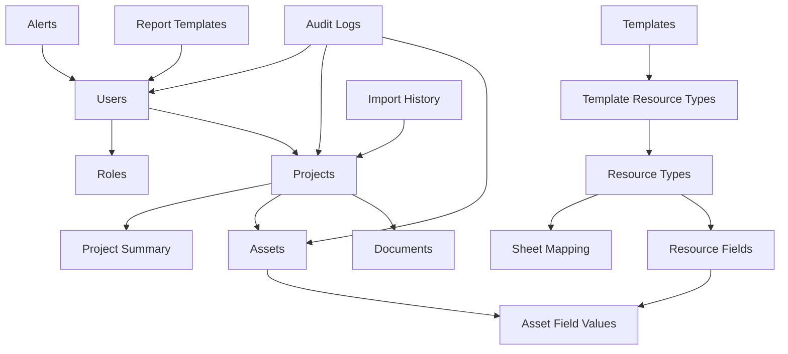
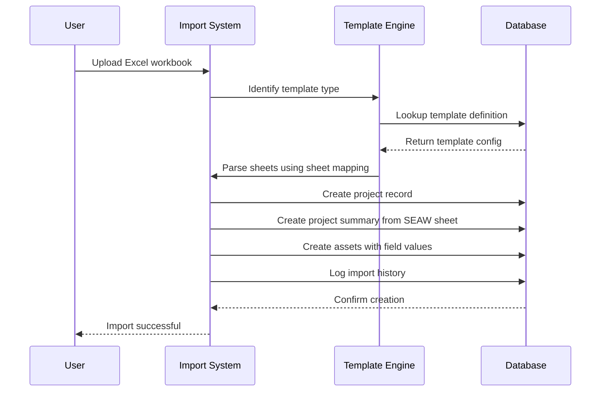
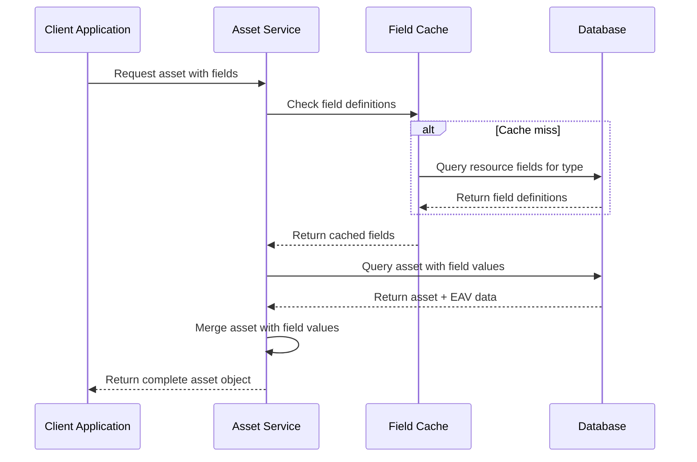

# Design Document: Database Schema Redesign

## Overview

This document outlines the complete architectural transformation of the PRMS database from a simple project-resource-asset_type model to a sophisticated template-driven system supporting Excel workbook-based templates with dynamic field mapping. The new schema introduces role-based access control, template versioning, dynamic field definitions using the Entity-Attribute-Value (EAV) pattern, comprehensive audit tracking, and flexible document management. This redesign enables the system to handle multiple client formats (Navy Standard, BEL Standard, HAL Standard) while maintaining data integrity and performance through proper indexing and referential constraints.

## Architecture

The new database architecture follows a modular, template-driven approach that separates concerns between user management, template definitions, project data, and dynamic asset tracking.



## Sequence Diagrams

### Excel Import and Project Creation Flow



### Dynamic Field Resolution Flow



## Components and Interfaces

### Component 1: Role Management System

**Purpose**: Manages predefined user roles with hierarchical permissions

**Interface**:
```pascal
INTERFACE RoleManager
  PROCEDURE validateRole(role_name: String): Boolean
  PROCEDURE getUserPermissions(user_id: UUID): PermissionSet
  PROCEDURE checkPermission(user_id: UUID, resource: String, action: String): Boolean
END INTERFACE
```

**Responsibilities**:
- Enforce role-based access control
- Validate role assignments
- Provide permission checking for all system operations

### Component 2: Template Engine

**Purpose**: Manages workbook template definitions and sheet mappings

**Interface**:
```pascal
INTERFACE TemplateEngine
  PROCEDURE identifyTemplate(workbook_metadata: WorkbookMeta): TemplateInfo
  PROCEDURE getSheetMappings(template_id: UUID): MappingSet
  PROCEDURE validateWorkbookStructure(workbook: ExcelFile, template: TemplateInfo): ValidationResult
END INTERFACE
```

**Responsibilities**:
- Template type identification from workbook structure
- Sheet name mapping to resource types
- Workbook validation against template definitions

### Component 3: Dynamic Field System

**Purpose**: Manages dynamic field definitions and EAV data storage

**Interface**:
```pascal
INTERFACE FieldSystem
  PROCEDURE getFieldDefinitions(resource_type_id: UUID): FieldDefinitionSet
  PROCEDURE validateFieldValue(field_def: FieldDefinition, value: Variant): ValidationResult
  PROCEDURE storeFieldValues(asset_id: UUID, field_values: FieldValueMap): Boolean
  PROCEDURE queryAssetsByFields(criteria: FieldCriteria): AssetSet
END INTERFACE
```

**Responsibilities**:
- Dynamic field definition management
- Field value validation and storage
- Flexible querying of assets by custom fields

### Component 4: Import Processing System

**Purpose**: Handles Excel workbook import and data transformation

**Interface**:
```pascal
INTERFACE ImportProcessor
  PROCEDURE processWorkbook(workbook: ExcelFile, user_id: UUID): ImportResult
  PROCEDURE createProjectFromWorkbook(workbook_data: ParsedData): Project
  PROCEDURE extractSEAWData(seaw_sheet: ExcelSheet): ProjectSummary
  PROCEDURE importAssetsFromSheets(sheets: SheetSet, mappings: MappingSet): AssetSet
END INTERFACE
```

**Responsibilities**:
- Excel file parsing and validation
- Project and asset creation from workbook data
- Import history tracking and error handling

## Data Models

### Model 1: Enhanced User

```pascal
STRUCTURE User
  id: UUID PRIMARY KEY
  username: String UNIQUE NOT NULL
  email: String UNIQUE NOT NULL
  password_hash: String NOT NULL
  employee_id: String UNIQUE
  department: String
  designation: String
  phone: String
  role_id: UUID FOREIGN KEY -> Roles.id
  is_active: Boolean DEFAULT true
  force_password_change: Boolean DEFAULT false
  last_login: Timestamp
  created_at: Timestamp DEFAULT CURRENT_TIMESTAMP
  updated_at: Timestamp DEFAULT CURRENT_TIMESTAMP
  deleted_at: Timestamp
END STRUCTURE
```

**Validation Rules**:
- Email must be valid format and unique across active users
- Employee ID must be unique if provided
- Role must exist in roles table
- Phone number format validation if provided

### Model 2: Template

```pascal
STRUCTURE Template
  id: UUID PRIMARY KEY
  name: String UNIQUE NOT NULL
  description: Text
  version: String NOT NULL
  client_type: String NOT NULL
  is_active: Boolean DEFAULT true
  template_config: JSONB NOT NULL
  created_by: UUID FOREIGN KEY -> Users.id
  created_at: Timestamp DEFAULT CURRENT_TIMESTAMP
  updated_at: Timestamp DEFAULT CURRENT_TIMESTAMP
END STRUCTURE
```

**Validation Rules**:
- Name must be unique across active templates
- Version must follow semantic versioning (major.minor.patch)
- Client type must be one of: Navy Standard, BEL Standard, HAL Standard
- Template config must contain valid JSON schema definition

### Model 3: Asset (Unified)

```pascal
STRUCTURE Asset
  id: UUID PRIMARY KEY
  project_id: UUID FOREIGN KEY -> Projects.id
  resource_type_id: UUID FOREIGN KEY -> ResourceTypes.id
  name: String NOT NULL
  serial_number: String
  manufacturer: String
  model: String
  cost: Decimal(15,2) NOT NULL
  warranty_expiry: Date
  custodian_id: UUID FOREIGN KEY -> Users.id
  location: String
  audit_status: String CHECK IN ('Pending', 'Completed', 'Overdue')
  last_audit_date: Date
  status: String DEFAULT 'Active' CHECK IN ('Active', 'Inactive', 'Disposed', 'Under Repair')
  created_by: UUID FOREIGN KEY -> Users.id
  created_at: Timestamp DEFAULT CURRENT_TIMESTAMP
  updated_at: Timestamp DEFAULT CURRENT_TIMESTAMP
  deleted_at: Timestamp
END STRUCTURE
```

**Validation Rules**:
- Serial number must be unique if provided
- Cost must be positive decimal
- Audit status drives audit workflow triggers
- Custodian must be active user if assigned

### Model 4: Resource Field (Dynamic Field Definition)

```pascal
STRUCTURE ResourceField
  id: UUID PRIMARY KEY
  resource_type_id: UUID FOREIGN KEY -> ResourceTypes.id
  field_name: String NOT NULL
  field_label: String NOT NULL
  field_type: String NOT NULL CHECK IN ('text', 'number', 'date', 'dropdown', 'boolean', 'decimal', 'email', 'url')
  is_required: Boolean DEFAULT false
  default_value: String
  validation_rules: JSONB
  display_order: Integer NOT NULL
  is_active: Boolean DEFAULT true
  created_at: Timestamp DEFAULT CURRENT_TIMESTAMP
  updated_at: Timestamp DEFAULT CURRENT_TIMESTAMP
  UNIQUE(resource_type_id, field_name)
END STRUCTURE
```

**Validation Rules**:
- Field name must be unique within resource type
- Display order must be positive integer
- Validation rules must be valid JSON schema
- Field type determines value storage and validation format

### Model 5: Asset Field Value (EAV Storage)

```pascal
STRUCTURE AssetFieldValue
  id: UUID PRIMARY KEY
  asset_id: UUID FOREIGN KEY -> Assets.id ON DELETE CASCADE
  resource_field_id: UUID FOREIGN KEY -> ResourceFields.id
  text_value: String
  number_value: Decimal(15,4)
  date_value: Date
  boolean_value: Boolean
  created_at: Timestamp DEFAULT CURRENT_TIMESTAMP
  updated_at: Timestamp DEFAULT CURRENT_TIMESTAMP
  UNIQUE(asset_id, resource_field_id)
END STRUCTURE
```

**Validation Rules**:
- Only one value column should be populated based on field type
- Value must conform to field definition validation rules
- Asset and field must exist and be active

## Algorithmic Pseudocode

### Main Project Import Algorithm

```pascal
ALGORITHM importExcelWorkbook(workbook_file, user_id)
INPUT: workbook_file of type ExcelFile, user_id of type UUID
OUTPUT: import_result of type ImportResult

BEGIN
  ASSERT validateUser(user_id) = true
  ASSERT validateFile(workbook_file) = true
  
  // Step 1: Template identification with error handling
  template_info ← identifyTemplateFromWorkbook(workbook_file)
  IF template_info = null THEN
    RETURN ImportResult(success: false, error: "Unknown template format")
  END IF
  
  // Step 2: Validate workbook structure against template
  validation_result ← validateWorkbookStructure(workbook_file, template_info)
  IF validation_result.is_valid = false THEN
    RETURN ImportResult(success: false, errors: validation_result.errors)
  END IF
  
  // Step 3: Begin transaction for data consistency
  BEGIN TRANSACTION
  
  TRY
    // Step 4: Create project record
    project_data ← extractProjectMetadata(workbook_file)
    project ← createProject(project_data, template_info.id, user_id)
    
    // Step 5: Process SEAW sheet if present
    seaw_sheet ← findSEAWSheet(workbook_file)
    IF seaw_sheet ≠ null THEN
      project_summary ← extractSEAWData(seaw_sheet)
      createProjectSummary(project.id, project_summary)
    END IF
    
    // Step 6: Process asset sheets with loop invariant
    sheet_mappings ← getSheetMappings(template_info.id)
    total_assets_created ← 0
    
    FOR each mapping IN sheet_mappings DO
      ASSERT total_assets_created ≥ 0  // Loop invariant
      
      sheet ← findSheet(workbook_file, mapping.sheet_pattern)
      IF sheet ≠ null THEN
        assets ← processAssetSheet(sheet, mapping, project.id, user_id)
        total_assets_created ← total_assets_created + LENGTH(assets)
      END IF
    END FOR
    
    // Step 7: Create import history record
    import_history ← createImportHistory(
      project.id, user_id, workbook_file.metadata, 
      total_assets_created, template_info.id
    )
    
    COMMIT TRANSACTION
    
    RETURN ImportResult(
      success: true, 
      project_id: project.id,
      assets_created: total_assets_created,
      import_id: import_history.id
    )
    
  CATCH error
    ROLLBACK TRANSACTION
    logAuditEvent(user_id, "IMPORT", null, "FAILURE", error.message)
    RETURN ImportResult(success: false, error: error.message)
  END TRY
END
```

**Preconditions:**
- workbook_file is a valid Excel file with readable sheets
- user_id corresponds to an active user with import permissions
- Database connection is available and transactions are supported

**Postconditions:**
- If successful: Project, assets, and import history are created atomically
- If failed: No partial data is left in database (transaction rollback)
- Audit log entry is created for both success and failure cases
- Import result contains complete status and identifiers

**Loop Invariants:**
- total_assets_created remains non-negative throughout iteration
- All previously processed sheets have valid asset records in database
- Transaction remains open and valid during entire processing loop

### Dynamic Field Value Resolution Algorithm

```pascal
ALGORITHM resolveAssetWithFields(asset_id)
INPUT: asset_id of type UUID
OUTPUT: complete_asset of type AssetWithFields

BEGIN
  ASSERT asset_id ≠ null
  
  // Step 1: Load base asset record
  base_asset ← loadAsset(asset_id)
  IF base_asset = null OR base_asset.deleted_at ≠ null THEN
    RETURN null
  END IF
  
  // Step 2: Get field definitions for resource type
  field_definitions ← getFieldDefinitions(base_asset.resource_type_id)
  
  // Step 3: Load field values with default handling
  complete_asset ← base_asset
  complete_asset.field_values ← EMPTY_MAP
  
  FOR each field_def IN field_definitions DO
    field_value ← loadFieldValue(asset_id, field_def.id)
    
    IF field_value ≠ null THEN
      complete_asset.field_values[field_def.field_name] ← field_value.getValue()
    ELSE IF field_def.default_value ≠ null THEN
      complete_asset.field_values[field_def.field_name] ← field_def.default_value
    ELSE
      complete_asset.field_values[field_def.field_name] ← null
    END IF
  END FOR
  
  RETURN complete_asset
END
```

**Preconditions:**
- asset_id is a valid UUID
- Database contains consistent field definitions and values
- Asset record exists and is not soft-deleted

**Postconditions:**
- Returns complete asset with all field values populated
- Missing values are set to defaults or null as appropriate
- Field definitions determine the structure of returned field values
- No database mutations occur during resolution

**Loop Invariants:**
- All previously processed fields have values assigned (default or actual)
- complete_asset.field_values map remains consistent and valid
- Field definitions list maintains consistent ordering

### Template Identification Algorithm

```pascal
ALGORITHM identifyTemplateFromWorkbook(workbook)
INPUT: workbook of type ExcelFile
OUTPUT: template_info of type TemplateInfo or null

BEGIN
  ASSERT workbook ≠ null AND workbook.isValid() = true
  
  // Step 1: Extract workbook metadata signatures
  sheet_names ← extractSheetNames(workbook)
  header_signatures ← EMPTY_MAP
  
  FOR each sheet IN workbook.sheets DO
    IF sheet.hasHeaders() THEN
      header_signatures[sheet.name] ← extractHeaderSignature(sheet)
    END IF
  END FOR
  
  // Step 2: Match against known templates with scoring
  active_templates ← loadActiveTemplates()
  best_match ← null
  highest_score ← 0.0
  
  FOR each template IN active_templates DO
    ASSERT template.is_active = true  // Only active templates
    
    score ← calculateMatchScore(sheet_names, header_signatures, template.config)
    
    IF score > highest_score AND score ≥ MINIMUM_MATCH_THRESHOLD THEN
      highest_score ← score
      best_match ← template
    END IF
  END FOR
  
  // Step 3: Validate minimum confidence threshold
  IF best_match ≠ null AND highest_score ≥ MINIMUM_MATCH_THRESHOLD THEN
    RETURN TemplateInfo(
      id: best_match.id,
      name: best_match.name,
      version: best_match.version,
      confidence: highest_score
    )
  ELSE
    RETURN null
  END IF
END
```

**Preconditions:**
- workbook is a valid Excel file with accessible sheets
- At least one active template exists in database
- Template configurations contain valid matching criteria

**Postconditions:**
- Returns template with highest confidence score above threshold
- null returned if no template meets minimum confidence requirements
- Template identification is deterministic for same input workbook
- No database modifications occur during identification

**Loop Invariants:**
- highest_score represents the best match found so far
- best_match corresponds to template with highest_score
- All processed templates have been compared against workbook signatures

## Key Functions with Formal Specifications

### Function 1: validateFieldValue()

```pascal
FUNCTION validateFieldValue(field_definition: FieldDefinition, value: Variant): ValidationResult
```

**Preconditions:**
- field_definition is non-null with valid field_type
- value is provided (may be null if field allows it)
- field_definition.validation_rules contains valid JSON schema

**Postconditions:**
- Returns ValidationResult with success/failure status
- If successful: value conforms to field type and validation rules
- If failed: result contains descriptive error messages
- No side effects on input parameters

**Loop Invariants:** N/A (no loops in validation function)

### Function 2: createAssetWithFields()

```pascal
FUNCTION createAssetWithFields(asset_data: AssetData, field_values: FieldValueMap): Asset
```

**Preconditions:**
- asset_data contains valid project_id and resource_type_id
- field_values map keys correspond to existing field definitions
- All required fields have values in field_values map
- User has permission to create assets in specified project

**Postconditions:**
- Returns created Asset with generated UUID
- Asset record and all field values are persisted atomically
- If validation fails: no records are created (transaction rollback)
- Audit log entry records asset creation event

**Loop Invariants:**
- For field value creation loop: All previously processed fields are persisted
- Validation state remains consistent throughout field processing

### Function 3: updateTemplate()

```pascal
FUNCTION updateTemplate(template_id: UUID, updates: TemplateUpdate): Template
```

**Preconditions:**
- template_id corresponds to existing template
- updates contain valid template configuration changes
- User has admin permissions for template management
- Version number follows semantic versioning if changed

**Postconditions:**
- Returns updated Template with new configuration
- Template versioning is properly maintained
- Dependent projects and imports remain compatible
- Template change is logged in audit system

**Loop Invariants:**
- For validation loop: All configuration elements remain internally consistent
- Template integrity is maintained throughout update process

## Example Usage

```pascal
// Example 1: Complete workbook import workflow
BEGIN
  workbook ← loadExcelFile("navy_standard_project.xlsx")
  user_id ← getCurrentUser().id
  
  result ← importExcelWorkbook(workbook, user_id)
  
  IF result.success THEN
    DISPLAY "Import successful: " + result.assets_created + " assets created"
    project ← loadProject(result.project_id)
    DISPLAY "Project: " + project.name + " (ID: " + project.id + ")"
  ELSE
    DISPLAY "Import failed: " + result.error
    FOR each error IN result.errors DO
      DISPLAY "  - " + error.message + " at " + error.location
    END FOR
  END IF
END

// Example 2: Dynamic asset querying with custom fields
BEGIN
  search_criteria ← FieldCriteria()
  search_criteria.addFilter("manufacturer", "EQUALS", "Dell")
  search_criteria.addFilter("warranty_expiry", "AFTER", "2024-12-31")
  search_criteria.addFilter("cost", "BETWEEN", 1000.00, 5000.00)
  
  assets ← queryAssetsByFields(search_criteria)
  
  FOR each asset IN assets DO
    complete_asset ← resolveAssetWithFields(asset.id)
    DISPLAY asset.name + " - $" + asset.cost
    DISPLAY "  Serial: " + complete_asset.field_values["serial_number"]
    DISPLAY "  Location: " + complete_asset.field_values["location"]
  END FOR
END

// Example 3: Template-based validation
BEGIN
  workbook ← loadExcelFile("unknown_format.xlsx")
  template_info ← identifyTemplateFromWorkbook(workbook)
  
  IF template_info ≠ null THEN
    DISPLAY "Identified as: " + template_info.name + " v" + template_info.version
    DISPLAY "Confidence: " + (template_info.confidence * 100) + "%"
    
    validation ← validateWorkbookStructure(workbook, template_info)
    IF validation.is_valid THEN
      DISPLAY "Workbook structure is valid for import"
    ELSE
      DISPLAY "Validation errors found:"
      FOR each error IN validation.errors DO
        DISPLAY "  - " + error.sheet + ": " + error.message
      END FOR
    END IF
  ELSE
    DISPLAY "Unknown workbook format - cannot process"
  END IF
END
```

## Correctness Properties

The database schema redesign must satisfy these universal correctness properties:

### Property 1: Data Integrity Preservation
∀ asset ∈ Assets: (asset.deleted_at = null) ⟹ ∃ project ∈ Projects: (project.id = asset.project_id ∧ project.deleted_at = null)

**Meaning**: All active assets must belong to active projects (referential integrity with soft deletes)

### Property 2: Field Value Consistency
∀ field_value ∈ AssetFieldValues: ∃ field_def ∈ ResourceFields: (field_def.id = field_value.resource_field_id ∧ validateType(field_value, field_def.field_type) = true)

**Meaning**: All stored field values must conform to their field definition types

### Property 3: Role-Based Access Control
∀ user ∈ Users, operation ∈ Operations, resource ∈ Resources: allowOperation(user, operation, resource) ⟹ hasPermission(user.role, operation, resource.type)

**Meaning**: Users can only perform operations their role permits on appropriate resources

### Property 4: Template Consistency
∀ project ∈ Projects: project.template_id ≠ null ⟹ ∀ asset ∈ project.assets: asset.resource_type_id ∈ getTemplateResourceTypes(project.template_id)

**Meaning**: All assets in a project must use resource types defined in the project's template

### Property 5: Import Atomicity
∀ import_operation ∈ ImportOperations: (import_operation.status = "SUCCESS") ⟺ (∀ entity ∈ import_operation.created_entities: entity.exists_in_database = true)

**Meaning**: Import operations are all-or-nothing - either all entities are created or none are

### Property 6: Audit Trail Completeness
∀ entity ∈ {Users, Projects, Assets, Templates}: ∀ operation ∈ {CREATE, UPDATE, DELETE}: performOperation(entity, operation) ⟹ ∃ audit_log ∈ AuditLogs: (audit_log.entity_id = entity.id ∧ audit_log.operation = operation)

**Meaning**: All critical operations must generate audit log entries

### Property 7: Field Value Completeness
∀ asset ∈ Assets, field ∈ RequiredFields: field.resource_type_id = asset.resource_type_id ⟹ ∃ value ∈ AssetFieldValues: (value.asset_id = asset.id ∧ value.resource_field_id = field.id ∧ value ≠ null)

**Meaning**: All required fields must have non-null values for every asset

## Error Handling

### Error Scenario 1: Template Identification Failure

**Condition**: Uploaded workbook format doesn't match any known template
**Response**: Return structured error with suggestions for closest template matches
**Recovery**: Allow manual template selection or template creation wizard

### Error Scenario 2: Field Validation Failure

**Condition**: Asset field value doesn't conform to field definition constraints
**Response**: Reject entire asset creation with detailed validation error messages
**Recovery**: Provide field-level error feedback and correction suggestions

### Error Scenario 3: Import Transaction Rollback

**Condition**: Database constraint violation or system error during import
**Response**: Rollback all changes, log detailed error information, preserve uploaded file
**Recovery**: Allow retry after fixing data issues or system problems

### Error Scenario 4: Template Version Conflict

**Condition**: Project created with older template version has incompatible field definitions
**Response**: Provide template migration wizard to handle field mapping changes
**Recovery**: Create field mapping rules or archive old field values before migration

## Testing Strategy

### Unit Testing Approach

Focus on individual component testing with comprehensive coverage of business logic:

- **Template Engine**: Test template identification algorithms with various workbook formats
- **Field System**: Test EAV field validation, storage, and retrieval operations
- **Import Processor**: Test workbook parsing, data extraction, and error handling
- **Role Manager**: Test permission calculations and role inheritance scenarios

**Coverage Goals**: 95% code coverage with emphasis on error paths and edge cases

### Property-Based Testing Approach

**Property Test Library**: fast-check (JavaScript/TypeScript)

**Key Properties to Test**:
1. **Template Identification Determinism**: Same workbook always identifies same template
2. **Field Value Roundtrip**: Stored field values can be retrieved identically
3. **Import Idempotency**: Re-importing same workbook produces consistent results
4. **Role Permission Transitivity**: Role hierarchies maintain consistent permissions
5. **Data Integrity Constraints**: Database constraints prevent invalid state combinations

**Test Data Generation**:
- Generate valid/invalid Excel workbook structures
- Create random but valid field value combinations
- Generate user role and permission combinations
- Create template configuration variations

### Integration Testing Approach

**Database Integration**:
- Test complete import workflows with real Excel files
- Verify foreign key constraints and cascading operations
- Test transaction rollback scenarios and data consistency

**API Integration**:
- Test end-to-end workflows from file upload to project creation
- Verify role-based access control across all endpoints
- Test concurrent operations and data isolation

## Performance Considerations

**Database Indexing Strategy**:
- Composite indexes on frequently queried field combinations (project_id + resource_type_id)
- GIN indexes on JSONB columns for flexible field value queries
- Partial indexes on soft-deleted records to improve active data performance

**Caching Strategy**:
- Template definitions cached in Redis with TTL for template changes
- Field definitions cached per resource type with invalidation on schema changes
- User permissions cached with session-based expiration

**Query Optimization**:
- Use window functions for complex reporting queries
- Implement query result pagination for large asset lists  
- Optimize EAV queries using proper join strategies and filtering

**Scalability Considerations**:
- Horizontal partitioning of audit logs by date ranges
- Read replicas for reporting and dashboard queries
- Connection pooling and query timeout configuration

## Security Considerations

**Access Control**:
- Row-level security policies for multi-tenant data isolation
- API rate limiting to prevent abuse of import operations
- File upload validation and virus scanning for Excel files

**Data Protection**:
- Encryption of sensitive fields (employee_id, personal information)
- Audit log retention policies and secure archival procedures
- Database connection encryption and certificate validation

**Input Validation**:
- Comprehensive validation of Excel file structure and content
- SQL injection prevention through parameterized queries
- XSS protection for user-generated content in field values

**Compliance Requirements**:
- GDPR compliance for user data handling and deletion
- Audit trail requirements for financial and regulatory reporting
- Data retention policies for different types of records

## Dependencies

**Database System**:
- PostgreSQL 13+ with JSONB support and GIN indexing
- uuid-ossp extension for UUID generation
- pg_trgm extension for fuzzy text matching in template identification

**Excel Processing**:
- openpyxl (Python) or ExcelJS (Node.js) for workbook parsing
- pandas (Python) or similar for data transformation
- File format validation libraries for security

**Caching and Performance**:
- Redis for caching template and field definitions
- Connection pooling library (pgbouncer or application-level)
- Query optimization tools and monitoring

**Security and Compliance**:
- bcrypt or Argon2 for password hashing
- JWT libraries for stateless authentication
- File scanning libraries for upload security
- Audit logging framework with structured output

**Development and Testing**:
- Alembic (Python) or similar for database migrations
- Property-based testing libraries (fast-check, hypothesis, QuickCheck)
- Test data factories for generating valid test scenarios
- Performance testing tools for load testing import operations